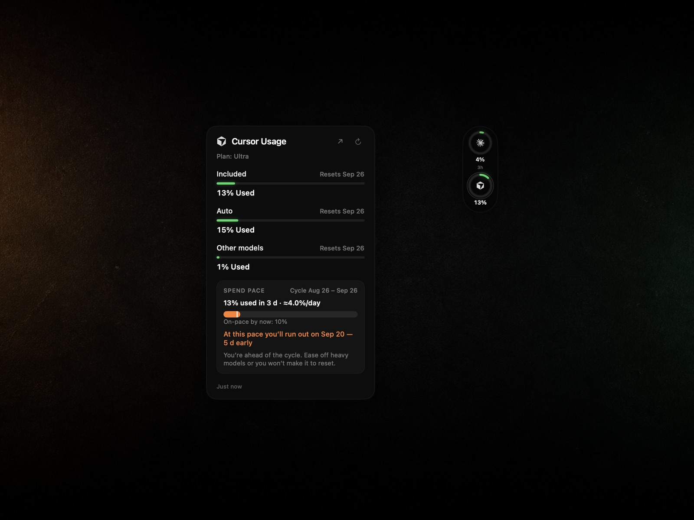

# CheckUsage

**Langue :** [English](../../README.md) · [Русский](ru.md) · [简体中文](zh-Hans.md) · [日本語](ja.md) · [Deutsch](de.md) · [Español](es.md) · [Français](fr.md) · [Português (Brasil)](pt-BR.md) · [한국어](ko.md)

Les quotas des outils IA déjà connectés sur votre Mac — une **pilule** fine au bord de l’écran, des anneaux, un popover de détail. Pas de second login. Pas de télémétrie.

<p align="center">
  
</p>

CheckUsage vit dans la barre des menus et peut coller une pilule sombre à n’importe quel bord. Chaque anneau est la vraie marque du fournisseur. Survol pour jeter un œil, clic pour épingler. Le popover montre session / semaine / offre, l’heure de reset, et une carte de rythme : combien du cycle est parti, si vous êtes en avance, et à quelle date ce rythme viderait la limite.

**Par défaut :** en haut à droite et **verrouillée**, fermeture au clic dehors, `⌥⌘U` affiche/masque le widget, `⌥⌘L` ouvre les derniers quotas. Déverrouillez pour glisser — elle s’aimante au bord. Le reset Cursor est la date de facturation mensuelle, pas « ce samedi ».

**Statut :** maintenu activement. Les compteurs non officiels peuvent casser sans préavis — voir [SECURITY.md](../../SECURITY.md) et [CHANGELOG.md](../../CHANGELOG.md).

## Qu’est-ce que c’est

Un instrument à coup d’œil pour qui fait tourner plusieurs agents IA sur un Mac. Le pire reste peut aller dans la barre. Les anneaux, au bord. Le détail, au survol ou au clic. Ce n’est ni un livre de comptes ni un parseur de chats locaux.

## Ce qu’il lit

| Fournisseur | Source | Session réutilisée |
|---|---|---|
| Claude | `GET /api/oauth/usage` | Trousseau Claude Code |
| Codex | ChatGPT `wham/usage` | `~/.codex/auth.json` ou trousseau Codex |
| Cursor | Tableau `GetCurrentPeriodUsage` | Cursor `state.vscdb` / trousseau CLI |
| Copilot | GitHub `copilot_internal/user` | `gh` / jeton éditeur Copilot |
| Gemini CLI | Cloud Code `retrieveUserQuota` | `~/.gemini/oauth_creds.json` |
| Grok | Proxy de facturation CLI | `~/.grok/auth.json` |
| Antigravity | Synthèse quota Cloud Code | Trousseau `gemini` / `antigravity` |
| OpenCode | Usage OpenCode Go | `~/.local/share/opencode/auth.json` |
| OpenRouter | Officiel `/credits` + `/key` | Clé API dans Réglages |
| DeepSeek | Officiel `/user/balance` | Clé API dans Réglages |
| Z.ai / GLM | Endpoint de quota | Clé API dans Réglages |

Les outils déconnectés restent cachés tant que **Afficher les outils déconnectés** n’est pas activé.

La plupart des compteurs d’abonnement sont des endpoints **non officiels** déjà appelés par les apps officielles. Ils peuvent changer. OpenRouter, DeepSeek et Z.ai utilisent des API documentées.

## Prérequis

- macOS 14 ou plus récent
- Xcode 16+ / Swift 6 (pour compiler)
- [XcodeGen](https://github.com/yonaskolb/XcodeGen) (`brew install xcodegen`)
- CLI ou apps officielles déjà connectées

## Installation

### Option A — Release GitHub

1. Ouvrir la dernière [Release](https://github.com/sysrootix/check-usage/releases).
2. Télécharger `CheckUsage.app.zip`, décompresser, glisser **CheckUsage** dans `/Applications`.
3. Premier lancement : clic droit → **Ouvrir** (signature ad hoc). macOS peut demander le réseau et le trousseau — **Toujours autoriser** pour Claude / `gh` afin de rafraîchir en arrière-plan.

### Option B — Compiler depuis les sources

```bash
git clone https://github.com/sysrootix/check-usage.git
cd check-usage
make app
open dist/CheckUsage.app
```

Placez l’app dans `/Applications` pour **Ouvrir à la connexion**.

## Premier lancement

1. Laissez les CLI/apps officielles connectées (Claude Code, Cursor, `gh auth login`, `codex login`, …).
2. Lancez CheckUsage. Les anneaux apparaissent pour ce qui est déjà authentifié.
3. Survolez pour regarder, cliquez pour épingler. Clic sur le bureau ou Escape ferme (ou gardez-le collant dans Réglages).
4. Le `↗` du popover ouvre le tableau de bord du fournisseur.
5. Clic droit sur la pilule ou l’item de barre : réglages / actualiser / quitter.
6. Déverrouillez pour glisser vers un autre bord. `⌥⌘U` masque ; `⌥⌘L` ouvre les derniers quotas même sans pilule.

Le reset court (`51m`, `3h`) n’apparaît que si la fenêtre fait moins de six heures. À partir de 90 % l’anneau pulse. Notifications optionnelles à 70 % et 90 %, une fois par cycle de facturation.

## Langues

Langue système, ou verrouillage dans Réglages :

English · Русский · 简体中文 · 日本語 · Deutsch · Español · Français · Português (Brasil) · 한국어

## Confidentialité

- Les jetons ne quittent ce Mac que vers l’émetteur.
- CheckUsage ne rafraîchit pas les jetons OAuth de Claude Code / Codex / Cursor. Session expirée : reconnectez-vous dans l’app officielle.
- Les clés API collées vont dans le trousseau `app.checkusage.secrets`.
- Pas d’analytique, pas de crash reporter, pas de comptes.
- Réglages : `~/Library/Application Support/CheckUsage/settings.json`. Réinstaller l’app ne supprime pas ce fichier.

## Développement

```bash
make project
make test
make app
```

Voir [CONTRIBUTING.md](../../CONTRIBUTING.md).

## Documentation

[Architecture](../ARCHITECTURE.md) · [Contributing](../../CONTRIBUTING.md) · [Sécurité](../../SECURITY.md) · [Changelog](../../CHANGELOG.md) · [Issues / feuille de route](https://github.com/sysrootix/check-usage/issues)

## Licence

MIT. Noms et marques des fournisseurs appartiennent à leurs propriétaires. Marques du panneau : SVG [Simple Icons](https://simpleicons.org).
