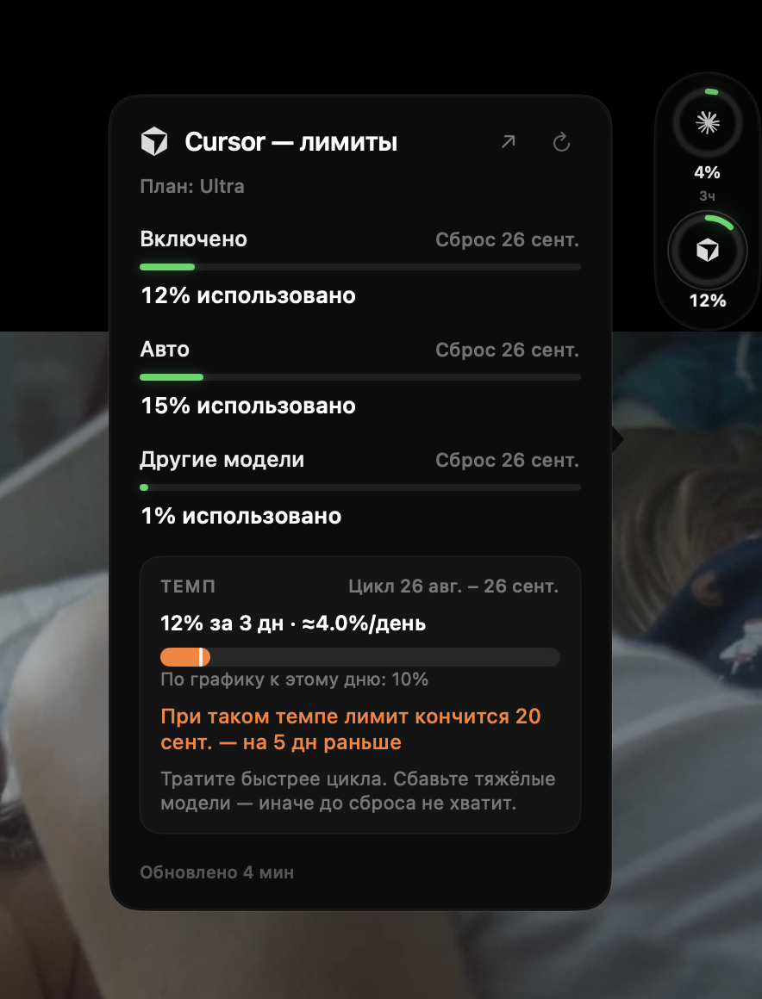

# CheckUsage

**Язык:** [English](../../README.md) · [Русский](ru.md) · [简体中文](zh-Hans.md) · [日本語](ja.md) · [Deutsch](de.md) · [Español](es.md) · [Français](fr.md) · [Português (Brasil)](pt-BR.md) · [한국어](ko.md)

Лимиты тех AI-инструментов, в которые вы уже вошли на Mac — тонкая **пилюля у края экрана** с кольцами и попап с деталями. Без отдельного логина. Без телеметрии.

<p align="center">
  
</p>

CheckUsage живёт в строке меню и может закрепить тёмную пилюлю у любого края. Каждое кольцо — настоящий знак провайдера. Наведение открывает окна лимитов, клик закрепляет попап. Внутри: сессия / неделя / план, время сброса и карточка темпа: сколько цикла уже сожжено, идёте ли вы впереди плана, и когда при таком темпе лимит кончится.

**По умолчанию:** виджет справа сверху и **заблокирован**, закрытие по клику мимо, `⌥⌘U` показывает/прячет виджет, `⌥⌘L` открывает последние лимиты. Снимите блок, чтобы перетащить — пилюля прилипнет к краю. Сброс Cursor — дата месячного биллинга, не «эта суббота».

## Что это

Прибор для тех, кто гоняет несколько AI-агентов на одном Mac. Худший остаток может быть в строке меню. Кольца — на краю. Детали — по наведению или клику. Это не бухгалтерская книга и не парсер локальных чатов.

## Что читает

| Провайдер | Откуда цифры | Чей вход переиспользует |
|---|---|---|
| Claude | `GET /api/oauth/usage` | Keychain Claude Code |
| Codex | ChatGPT `wham/usage` | `~/.codex/auth.json` или Keychain Codex |
| Cursor | Dashboard `GetCurrentPeriodUsage` | `state.vscdb` / Keychain CLI Cursor |
| Copilot | GitHub `copilot_internal/user` | `gh` / токен редактора Copilot |
| Gemini CLI | Cloud Code `retrieveUserQuota` | `~/.gemini/oauth_creds.json` |
| Grok | CLI billing proxy | `~/.grok/auth.json` |
| Antigravity | сводка квоты Cloud Code | Keychain `gemini` / `antigravity` |
| OpenCode | usage OpenCode Go | `~/.local/share/opencode/auth.json` |
| OpenRouter | официальные `/credits` + `/key` | ключ в Настройках |
| DeepSeek | официальный `/user/balance` | ключ в Настройках |
| Z.ai / GLM | эндпоинт квоты | ключ в Настройках |

Инструменты без входа скрыты, пока не включите **Показывать без входа**.

Большинство счётчиков подписки — **неофициальные** эндпоинты, которые уже дергают официальные приложения. Они могут измениться. OpenRouter, DeepSeek и Z.ai — документированные API.

## Требования

- macOS 14 или новее
- Xcode 16+ / Swift 6 (чтобы собрать из исходников)
- [XcodeGen](https://github.com/yonaskolb/XcodeGen) (`brew install xcodegen`)
- Официальные CLI или приложения уже должны быть залогинены

## Установка

### Вариант A — релиз на GitHub

1. Откройте последний [Release](https://github.com/sysrootix/check-usage/releases).
2. Скачайте `CheckUsage.app.zip`, распакуйте, перетащите **CheckUsage** в `/Applications`.
3. Первый запуск: правый клик → **Открыть** (подпись ad-hoc). macOS может спросить сеть и связку ключей — для пунктов Claude / `gh` лучше **Всегда разрешать**, чтобы панель обновлялась в фоне.

### Вариант B — сборка из исходников

```bash
git clone https://github.com/sysrootix/check-usage.git
cd check-usage
make app
open dist/CheckUsage.app
```

Перетащите `dist/CheckUsage.app` в `/Applications`, если нужен запуск при входе.

## Первый запуск

1. Оставьте официальные CLI/приложения в системе (Claude Code, Cursor, `gh auth login`, `codex login`, …).
2. Запустите CheckUsage. Кольца появятся у тех, кто уже аутентифицирован.
3. Наведите на кольцо — заглянуть. Клик — закрепить. Клик по столу или Escape закрывает (или держите «липким» в Настройках).
4. Кнопка `↗` в попапе открывает дашборд провайдера.
5. Правый клик по пилюле или пункт в строке меню — настройки / обновить / выход.
6. Снимите блок, чтобы перетащить на другой край. `⌥⌘U` прячет; `⌥⌘L` открывает последние лимиты даже без пилюли.

Короткий сброс (`51м`, `3ч`) на кольце только если окно короче шести часов. С 90% кольцо пульсирует. Опциональные уведомления — на 70% и 90% один раз за биллинг-цикл.

## Языки интерфейса

Системный язык или фиксация в Настройках:

English · Русский · 简体中文 · 日本語 · Deutsch · Español · Français · Português (Brasil) · 한국어

## Настройки

Виджет на столе, прятать за край, положение, вертикаль/горизонталь, размер, отступ, блок позиции, прилипание, закрытие попапа, темп и прогноз, уведомления 70%/90%, остаток на кольцах, прозрачность, хоткеи, список провайдеров, язык, интервал обновления, показывать без входа, процент в меню, запуск при входе, ключи OpenRouter / DeepSeek / Z.ai.

## Приватность

- Токены не уходят с этого Mac, кроме как к выдавшему провайдеру.
- CheckUsage не обновляет чужие OAuth-токены Claude Code / Codex / Cursor. Сессия истекла — войдите снова в официальном приложении.
- Вставленные API-ключи лежат в связке ключей, сервис `app.checkusage.secrets`.
- Нет аналитики, краш-репортеров и аккаунтов.
- Настройки: `~/Library/Application Support/CheckUsage/settings.json`. Переустановка приложения этот файл не стирает.

## Разработка

```bash
make project
make test
make app
```

См. [CONTRIBUTING.md](../../CONTRIBUTING.md).

## Лицензия

MIT. Имена и знаки провайдеров принадлежат их владельцам. Марки на панели — SVG с [Simple Icons](https://simpleicons.org).
